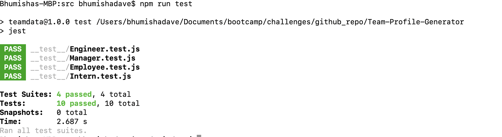
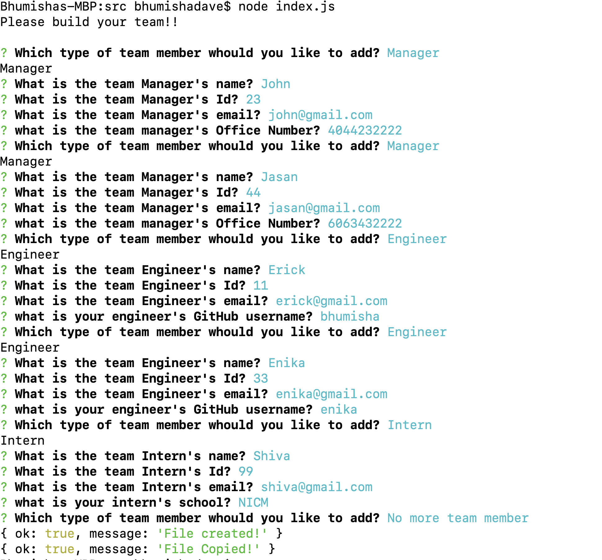
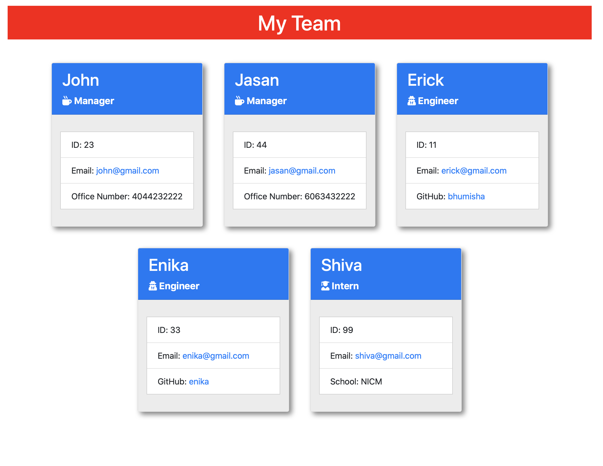

# Team-Profile-Generator

Team-Profile-Generator is collecting user's team information and creating nice team cards in HTML using node.js. It run only thru terminal. To developed this project, I have used file and inquirer node modules. Team is divided in Manager / Engineer and Intern. User can add n number of team member based on their role. User has to provide Github details and also school and project related informations. This project is deployed in Github. User can go thru files and clone the project.

### GitHub Detail -

Team-Profile-Generator project is uploaded in GitHub.

For clone the project use below options or you can download Zip file.

SSH "git@github.com:bhumisha/Team-Profile-Generator.git" HTTPS "https://github.com/bhumisha/Team-Profile-Generator.git"

Project Source code : https://github.com/bhumisha/Team-Profile-Generator

To check the project result , you need to clone and run below commands.
If you have not added node than please install node and than npm install.
than run node index.js will prompt user for team information and its team-profile for project.
We have also introduce Jest for unit testing. For each classes object we have completed unit testing.
All code is written in ES6 and HTML. 

Please find Project execution video @ 

**Jest UnitTest Coverage**

**Terminal Screen.**

**HTML Page**

